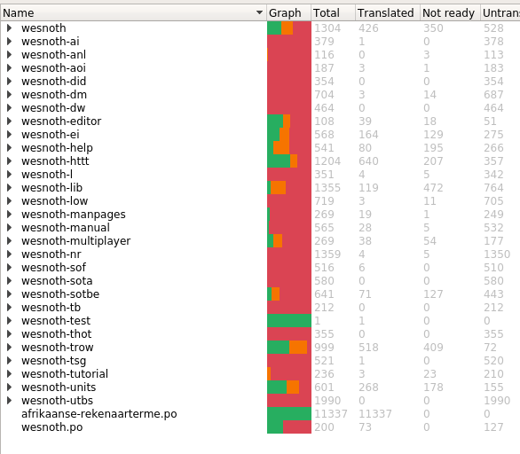

# wesnoth-af
My contribution to the Afrikaans translation of Battle for Wesnoth ( https://github.com/wesnoth/wesnoth )

## Afrikaanse vertaling

Die doel hiervan is om 'n plek te hê waar opgedateerde af.po lêers vir Wesnoth ( https://githbub.com/wesnoth/wesnoth ) te deel met ander vertalers.  Wesnoth laat wel nie direkte opdaterings (Pull requests) toe na hulle gitbhub stoorplek nie,  Wat ek wil vermy met hierdie repo is om oor en oor leêrs as aanhegsels na ander vertalers te stuur.  Ek wil ook 'n spasie skep waar aspekte van vertaling bespreek kan word.  Hierdie is nie ideaal daarvoor nie, maar as iemand 'n probleem met 'n aspek van 'n vertaling het, of 'n voorstel, kan Github se "Issues" opsies daarvoor gebruik word.

#### Manifes van Wesnoth Terme

Daar is 'n bykomende .po leêr, wesnoth.po wat nie deel van Wesnoth is nie.  Hierdie is egter 'n kritieke leêr wat dien as gesaghebbende manifes wat terminologie wat regdeur Wesnoth gebruik word bevat.

### Lokalize 

Waar die meeste Afrikaanse vertalers die program Virtaal gebruik, gebruik ek egter die Lokalize program vir 'n paar eenvoudige redes.

* Dit werk vir my.
* Dit word nie stadiger as 'n hele vertaalprojek gelaai word nie.
* In teenstelling met my vorige ondervinding met virtaal, het Lokalize nog nie 'n .po leêr verloor of gekorrupteer nie.  

Ek is oortuig dat Virtaal 'n puik program is en dat al die fouter en probleme uitegestreik is, maar ek is nou so diep gevestig in die gebruik van Lokalize vir ander projekte dat dit lankal verby die punt van verandering is.

### Afrikaanse Rekenaarterme

Hier is 'n bykomende leêr, afrikaanse-rekenaarterme.po wat 'n lang lys van Afrikaanse rekenaarterme bevat wat ek oor dekades vanaf verskeie bronne opgestel het.  Daardie leêr is nie deel van die Wesnoth vertaling nie, maar is deel van hierdie vertalingsprojek.  Dit word gedoen sodat daardie terminologie, net soos met wesnoth.po (die Wesnoth veraal manifes) in Lokalize se vertalings geheue kan wees.

## Spelverwante vertaling

In teenstelling met ander vertaal projekte van rekenaarprogrammatuur, moet daar in gedagte gehou word dat Wesnoth 'n speletjie is.  Daarom is daar 'n paar kernreëls wat ek wil volg.

* Die vertaling moet nie soos met ander rekenaarprogramme in Afrikaans 'n geboor in die oor wees nie.  Enigeen vanaf 'n sesjarige kind tot 'n pensionaris moet Wesnoth kan begin en dadelik tuis voel sonder om in die minste te wonder oor wat daardie term nou eintlik beteken.
* Die Afrikaanse terme moet opwekkend, ligsinnig en oorspronklik wees en moet die Afrikaanse speler net soveel meer motiveer om van Wesnoth te hou.
* Omdat Wesnoth 'n speletjie is, word daar heelwat beweegruimte vir die vertaling daarvan toegelaat.
  * Rekenaaar aspekte soos stoor, oopmaak ens moet voldoen aan die standaarde van Afrikaanse vertalings in die bedryf.
  * Die speletjie aspekte moet vloeiend, idiomaties en uniek Afrikaans wees, nie direkte sintaktiese vertalings van Engels nie.  Om te verstaan waarvan ek praat, kyk na die voorgestelde vertalings in wesnoth.po waar die Engelse "skeleton" nie met "geraamte" vertaal moet word nie, maar eerder "skeletdanser", beenratelaar of iets dergeliks wees wat eg Afrikaans is.  Ons het een kans hier om iets oulik te skep, kom ons foeter dit nie op nie.

## Voortsetting van baie harde werk

'n Groot deel van die werk is reeds gedoen.  Sonder die rekenaarterminologie en manifes leêrs, is daar bykans 17,000 terme om te vertaal. Maar ongeveer 4% is nie direkte woorde nie, maar lywige paragrawe wat vertaling in idiomaties Afrikaans benodig.  Huidiglik moet sowat 7% hersien word, eintlik moet alles eenmalig hersien word om die basis op te stel, en sowat 44% van die totale projek het geen vertaling nie.

Genoeg gepraat, daar is werk om te doen.
