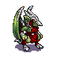
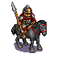
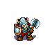
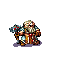
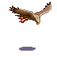
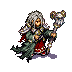
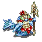
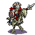
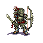

# Bestiary for Wesnoth 1.14

## Afrikaans

### Indeks 

* [Vlermuise (Bats)](#bats)

<h2 id="bats">Bats</h2>

* (Vampire Bat) 
  * (Blood Bat) 
    * (Dread Bat) 

<h2 id="drakes">Drakes</h2>

* (Drake Burner) 
  * (Drake Flare) 
    * (Drake Flameheart) 
      * (Armageddon Drake) 
  * (Fire Drake) 
    * (Inferno Drake) 

* (Drake Clasher) 
  * (Drake Arbiter) 
    * (Drake Warden) 
  * (Drake Thrasher) 
    * (Drake Enforcer) 

* (Drake Fighter) 
  * (Drake Warrior ) 
    * (Drake Blademaster) 

* (Drake Glider) 
  * (Sky Drake) 
    * (Hurricane Drake) 

<h2 id="dunefolk">Dunefolk</h2>

* (Dune Burner) 
  * (Dune Scorcher) 
    * (Dune Firetrooper) 

* (Dune Herbalist) 
  * (Dune Apothecary) 

* (Dune Piercer) 
  * (Dune Raider) 
    * (Dune Maruader) 
  * (Dune Sunderer) 
    * (Dune Cataphract) 

* (Dune Rider) 
  * (Dune Rider) 
    * (Dune Marauder) 
  * (Dune Swiftrider) 
    * (Dune Windrider) 

* (Dune Rover) 
  * (Dune Explorer) 
    * (Dune Ranger) 
  * (Dune Skirmisher) 
    * (Dune Harrier) 

* (Dune Soldier) 
  * (Dune Spearguard) 
    * (Dune Spearmaster) 
  * (Dune Sowrdsman) 
    * (Dune Blademaster) 
      * (Dune Warmaster) 

## Dwarves

* (Dwarvish Fighter) 
  * (Dwarvish Steelclad) 
    * (Dwarvish Lord) 
      * (Dwarvish Arcanister) 

* (Dwarvhis Guardsman) 
  * (Dwarvish Stalwart) 
    * (Dwarvish Sentinel) 
  * (Dwarvish Runesmith) 
    * (Dwarvish Runemaster) 

* (Dwarvish Scout) 
  * (Dwarvish Pathfinder) 
    * (Dwarvish Explorer) 

* (Dwarvish Thunderer) 
  * (Dwarvish Thunderguard) 
    * (Dwarvish Dragonguard) 

* (Dwarvish Ulfserker) 
  * (Dwarvish Beserker) 

<h2 ide="elves">Elves</h2>

* (Elvish Archer) 
  * (Elvish Marksman) 
    * (Elvish Sharpshooter) 
  * (Elvish Ranger) 
    * (Elvish Avenger) 

* (Elvish Figher) 
  * (Elvish Captain) 
    * (Elvish Marshall) 
  * (Elvish Hero) 
    * (Elvish Champion) 

* (Elvish Scout) 
  * (Elvish Rider) 
    * (Elvish Outrider) 

* (Elvish Shaman) 
  * (Elvish Druid) 
    * (Elvish Shyde) 
  * (Elvish Sorceress) 
    * (Elvish Enchantress) 
      * (Elvish Sylph) 

<h2 id="falcons">Falcons</h2>

* (Falcon) 
  * (Elder Falcon) 

<h2 id="goblins">Goblins</h2>

* (Goblin Spearman) 
  * (Goblin Impaler) 
  * (Goblin Rouser) 

<h2 id="gryphons">Gryphons</h2>

* (Grypon ) 

* (Gryphon Rider) 
  * (Gryphon Master) 

<h2 id="humans">Humans</h2>

* (Cavalryman) 
  * (Dragoon) 
    * (Cavalier) 

* (Dark Adept) 
  * (Dark Sorcerer) 
    * (Lich) 
    * (Necromancer) 
      Elder Mage 

* (Fencer) 
  * (Duelist) 
    * (Master at Arms) 

* (Heavy Infantryman) 
  * (Shock Trooper) 
    * (Iron Mauler) 

* (Horseman) 
  * (Knight) 
    * (Grand Knight) 
    * (Paladin) 
  * (Lancer) 

* (Mage) 
  * (Red Mage) 
    * (Arch Mage) 
      * (Great Mage) 
    * (Silver Mage) 
  * (White Mage) 
    * (Mage of Light) 

* (Bowman) 
  * (Longbowman) 
    * (Master Bowman) 

* (Peasant) 
  * (Spearman) 
    * (Javelineer) 
    * (Pikeman) 
      * (Halberdier) 
    * (Swordsman) 
      * (Royal Guard) 
      * (Royal Warrior) 

* (Ruffian) 
  * (Footpad) 
    * (Outlaw) 
      * (Fugitive) 
  * (Thug) 
    * (Bandit) 
      * (Highwayman) 

* (Seargeant) 
  * (Lieutenant) 
    * (General) 
      * (Grand Marshal) 

* (Thief) 
  * (Rogue) 
    * (Assassin) 

* (Woodsman) 
  * (Bowman)  
      * (Master Bowman) 
  * (Poacher) 
    * (Trapper) 
      * (Huntsman) 
      * (Ranger) 

<h2 id="mechanical">Mechanical</h2>

* (Boat) 
* Galleon 
* (Pirate Galleon) 
* Transport Galleon 

## Merfolk

* (Mermaid Initiate) 
  * (Mermaid Enchantress) 
    * (Mermaid Siren) 
  * (Mermaid Priestess) 
    * (Mermaid Diviner) 

* (Merman Fighter) 
  * (Merman Warrior) 
    * (Merman Hoplite) 
    * (Merman Triton) 

* (Merman Hunter) 
  * (Merman Netcaster) 
    * (Merman Entangler) 
  * (Merman Spearman) 
    Merman Javelineer 

## Monsters

* -
  * - 
    * (Cuttle Fish) 
* -
  * -
    * -
      * (Fire Dragon) 
* -
  * (Fire Guardian) 
* Giant Rat 
* (Giant Scorpling) 
  * (Giant Scorpion) 
* -
  * -
    * (Giant Spider) 
* (Mudcrawler) 
  * (Giant Mudcrawler) 
* - 
  * - 
    * -
      * (Sea Serpent) 
* -
  * (Tentacle of the Deep) 
* -
  * -
    * (Water Serpent) 
* - 
  * - 
    * -
      * - 
        * (Yeti) 

## Nagas

* (Naga Fighter) 
  * (Naga Warrior) 
    * (Naga Myrmidon) 

## Ogres

* (Young Ogre) 
  * (Ogre) 

## Orcs

* (Orcish Archer) 
  * (Orcish Crossbowman) 
    * (Orcish Slurbow) 
* Orcish Assassin 
  * (Orcish Slayer) 
* Orcish Grunt 
  * (Orcish Warrior) 
    * (Orcish Warlord) 
* Orcish Leader 
  * (Orcish Ruler) 
    * (Orcish Sovereign) 
* -
  * - 
    * (Orcish Nightblade) 

## Saurians

* (Saurian Augur) 
  * (Saurian Oracle) 
  * (Saurian Soothsayer) 

* (Saurian Skirmishers) 
  * (Saurian Ambusher) 
    * (Saurian Flanker) 

## Trolls

* -
  * (Troll Hero) 
    * (Great Troll) 

* -
  * (Troll Shaman) 

* (Troll Whelp) 
  * (Troll) 
    * (Troll Warrior) 
  * (Troll Rocklobber) 

## Undead

* -
  * -
    * - 
      * (Ancient Lich) 

* - 
  * (Chocobone) 

* -
  * -
    * (Death Knight) 

* (Ghost) 
  * (Shadow) 
    * (Nightgaunt) 
  * (Wraith) 
    * (Spectre) 

* (Ghoul) 
  * (Necrophage) 
    * (Ghast) 

* - 
  * -
    * -
      * (Skeletal Dragon) 

* (Skeleton) 
  * (Deathblade) 
  * (Revenant) 
    * (Draug) 

* (Skeleton Archer) 
  * (Bone Shooter) 
    * (Banebow) 

* (Walking Corpse)  

## Wolves

* -
  * -
    * (Direwolf) 

* -
  * (Great Wolf) 

* (Wolf) 

* (Wolf Rider) 
  * (Goblin Knight) 
    * (Direwolf Rider) 
  * (Goblin Pillager) 

## Woses

* (Wose) 
  * (Elder Wose) 
    * (Ancient Wose) 

## Unassigned ???

